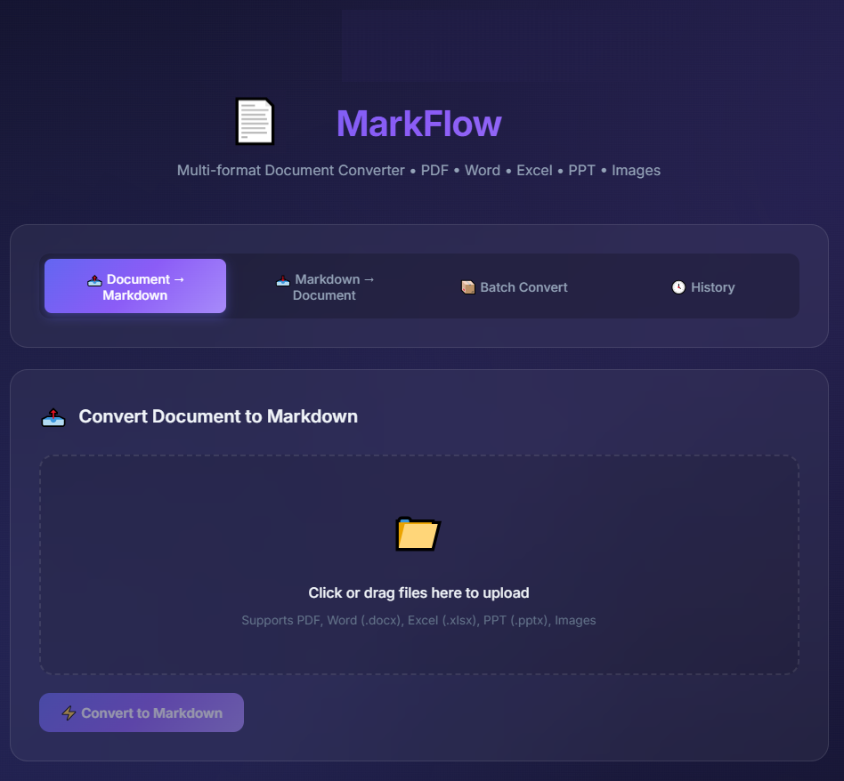

# 【开源】MarkFlow: 告别格式转换烦恼，一键搞定文档互转

> 你是否还在为文档格式转换而头疼？PDF转Word、Word转Markdown、图片提取文字...这些需求每天都在困扰着我们。今天给大家推荐一个开源神器——**MarkFlow**。

## 🎯 项目简介

MarkFlow 是一个基于 FastAPI 的多格式文档转换工具，支持 PDF、Word、Excel、PPT、图片与 Markdown 的双向转换。

**项目地址**: https://github.com/moduwusuowei/MarkFlow



## 💡 为什么选择 MarkFlow？

### 1. 全格式覆盖

| 场景 | 支持格式 |
|------|----------|
| 文档 → Markdown | PDF、Word、Excel、PPT、图片 |
| Markdown → 文档 | Word、Excel、PPT、PDF |
| 图片文字提取 | JPG、PNG、BMP、TIFF、GIF |

### 2. 现代化 UI

- 🌙 深色主题，护眼舒适
- ✨ 毛玻璃效果，视觉高级
- 🎭 流畅动画，交互丝滑
- 📱 响应式设计，手机也能用

### 3. 批量处理

一次上传多个文件，一键批量转换，效率翻倍。

### 4. OCR 识别

基于 RapidOCR，自动识别图片中的文字，支持中英文混合识别。

### 5. 本地历史

转换记录自动保存在浏览器，随时查看、一键重用。

## 🚀 5分钟上手

### 方式一：直接运行

```bash
# 克隆项目
git clone https://github.com/moduwusuowei/MarkFlow.git
cd MarkFlow

# 创建虚拟环境
python -m venv venv
source venv/bin/activate  # Linux/Mac
# Windows: venv\Scripts\activate

# 安装依赖
pip install -r requirements.txt

# 启动
python main.py
```

打开浏览器访问 http://localhost:8066，开始使用！

### 方式二：Docker 部署

```bash
# 一行命令搞定
docker run -d -p 8066:8066 markflow
```

## 📸 使用场景

### 场景一：技术文档迁移

公司有一堆 Word 格式的技术文档，想迁移到 GitBook 或 VuePress？

```
Word (.docx) → Markdown → GitBook/VuePress
```

MarkFlow 完美支持，保留格式、表格、代码块。

### 场景二：论文 PDF 提取

需要从 PDF 论文中提取文字内容？

```
PDF → Markdown → 编辑整理
```

支持复杂排版，表格、公式都能识别。

### 场景三：图片转文字

截图、扫描件中的文字怎么提取？

```
图片 → OCR → Markdown
```

中英文混合识别，准确率高。

### 场景四：批量格式转换

有 100 个文件需要统一转换格式？

```
批量上传 → 选择目标格式 → 一键下载
```

支持 ZIP 打包下载，省时省力。

## 🛠️ 技术架构

```
┌─────────────────────────────────────────┐
│              Frontend (HTML/JS)         │
│         Glass morphism UI + Fetch API   │
└─────────────────┬───────────────────────┘
                  │
┌─────────────────▼───────────────────────┐
│           FastAPI Backend               │
│  ┌─────────┬─────────┬─────────┐       │
│  │  PDF    │  Word   │  Excel  │ ...   │
│  │Converter│Converter│Converter│       │
│  └─────────┴─────────┴─────────┘       │
│           + RapidOCR (Image)           │
└─────────────────────────────────────────┘
```

**技术栈**:
- 后端: FastAPI + Uvicorn
- 文档处理: python-docx, openpyxl, python-pptx, PyPDF2
- Markdown: markitdown (微软出品)
- OCR: RapidOCR (onnxruntime)
- 前端: 原生 HTML/CSS/JS，零依赖

## 🆚 对比其他方案

| 特性 | MarkFlow | Pandoc | Cloud Convert |
|------|----------|--------|---------------|
| 部署方式 | 本地/Docker | 本地安装 | 云服务 |
| UI 界面 | ✅ 现代化 | ❌ 命令行 | ✅ 网页 |
| 批量转换 | ✅ | ✅ | ✅ (付费) |
| OCR 识别 | ✅ | ❌ | ✅ (付费) |
| 隐私安全 | ✅ 本地处理 | ✅ | ❌ 上传云端 |
| 免费开源 | ✅ | ✅ | ❌ |

**MarkFlow 的优势**:
- 本地部署，数据不外传
- 现代化 UI，操作简单
- 完全免费，MIT 开源

## 🔧 进阶使用

### API 调用

MarkFlow 提供完整的 REST API，可以集成到你的工作流中：

```python
import requests

# 文档转 Markdown
with open('document.pdf', 'rb') as f:
    response = requests.post(
        'http://localhost:8066/convert/to-markdown',
        files={'file': f}
    )
    markdown = response.json()['content']
```

### Docker Compose

```yaml
version: '3'
services:
  markflow:
    build: .
    ports:
      - "8066:8066"
    volumes:
      - ./uploads:/app/uploads
      - ./outputs:/app/outputs
    restart: unless-stopped
```

## 📈 未来计划

- [ ] 支持更多格式 (EPUB, HTML, RTF)
- [ ] 添加文件预览功能
- [ ] 支持自定义转换模板
- [ ] 添加 API Key 认证
- [ ] 支持云端存储 (S3, OSS)

## 🤝 参与贡献

MarkFlow 是一个开源项目，欢迎参与贡献！

1. Fork 项目
2. 创建功能分支
3. 提交代码
4. 发起 Pull Request

**贡献方向**:
- 🐛 Bug 修复
- ✨ 新功能开发
- 📝 文档完善
- 🌐 国际化翻译

## 📞 联系作者

- GitHub: [@moduwusuowei](https://github.com/moduwusuowei)
- 项目地址: https://github.com/moduwusuowei/MarkFlow

## 📄 开源协议

MIT License - 自由使用，自由修改，自由分发。

---

**如果觉得有用，欢迎 Star ⭐ 支持！**

> 工具的价值在于解决实际问题。MarkFlow 不是最强大的，但一定是最易用的。希望它能帮你节省时间，专注于更重要的事情。
